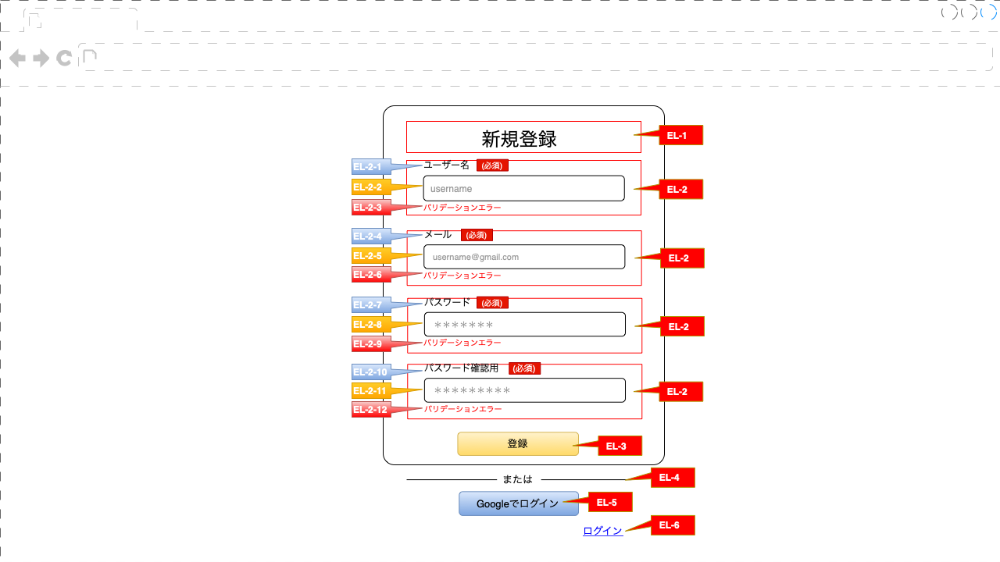

# 新規登録画面設計
## 画面レイアウト

>登録画面版
画面設計版参考

***
>ヘッダー説明

| ID    | 名称 | テキスト | エンティティ | 項目                 | サイズ         | イベント | 備考 |
|-------|--------|----------|--------------|----------------------|----------------|----------|------|
| EL-1  | 新規登録 | 新規登録| - | 画面中央| 画面設計版参考 | - | - |
>ボディー説明

|
ID
 |名称|テキスト|入力データ|エンティティ|項目|位置|サイズ|イベント|備考|						
|-|-|-|-|-|-|-|-|-|-|						
|EL-2|グループ投入|-|-|-|-|中央|-|-|ラベル, 入力メ, パリデーションエラ|						
|EL-2-1|ユーザー名|ユーザー名（必須）|ラベル|-|-|左|画面設計版参考|-|-|						
|EL-2-2|入力名|-|100文字以下|user_info|user_name|左|画面設計版参考|-|placeholder：username|						
|EL-2-3|パリデーションエラー名|-|-|-|-|左|画面設計版参考| -|参考：<a href="#v1">V1</a>|						
|EL-2-4|メール|メール（必須）|ラベル|-|-|左|画面設計版参考|-|-|						
|EL-2-5|入力メール|-|255文字以下、メール形式|user_info|email|左|画面設計版参考|-|placeholder：username@gmail.com|						
|EL-2-6|パリデーションエラーメール|-|-|-|-|左|画面設計版参考|-|参考：<a href="#v2">V2|						
|EL-2-7|パスワード|パスワード（必須）|ラベル|-|-|左|画面設計版参考|-|-|						
|EL-2-8|入力パスワード|-|6−100文字|user_info|password|左|画面設計版参考|-|placeholder：*******|						
|EL-2-9|パリデーションエラーパスワード|-|-|-|-|左|画面設計版参考|-|-参考：<a href="#v3">V3|						
|EL-2-10|パスワード確認用|パスワード確認用（必須）|ラベル|-|-|左|画面設計版参考|-|placeholder：*******|						
|EL-2-11|入力パスワード|-|上パスワード同じ|-|-|左|画面設計版参考|-|-|						
|EL-2-12|パリデーションエラーパスワード|-|-|-|-|左|画面設計版参考|-| 参考：<a href="#v4">V4|						
|EL-3|ボタン_登録|登録|ナビゲーションボタン|-|-|中央|画面設計版参考|<a href="#ev1">EV1|-|
|EL-4|備考|ーーーまたはーーー|ラベル|-|-|中央|画面設計版参考|-|-|
|EL-5|ボタン_GOOGLEでログイン|Googleでログイン|ナビゲーションボタン|user_google|-|中央|画面設計版参考|<a href="#ev2">EV2|-|	
|EL-６|ボタン_ログイン|ログイン|ナビゲーションボタン|-|-|右|画面設計版参考|<a href="#ev3">EV3|-|	

>インベント説明

|ID|イベント|動作|API|説明|備考|
|-|-|-|-|-|-|
|EV0|画面初期表示| - | - | データがないものだから,格パリデーション所にメッセージ表示ありません。  入力所に空値が表示される|
|
EV1
|登録する|『登録』ボタン押下|A1|フォーム登録データから受け取り、パリデーション操作する。 1. エラー場合は エラーメッセージ表示出し。（参考[パリデーション説明](#パリデーション説明)。）   2. エラーない場合は,    A1のAPIを呼び出し。|API呼び出し後は ①発生するデータ場合は、エラのコードに応じてエラー情報ページ表示出し。 ②　role_name=admin場合、システム管理ページ表示する ③　role_name=user場合、 メッセージ：登録完成した、ありがとうございます。|
|
EV2
|Google ログイン画面移行する|『Google ログイン』ボタン押下|A2|Googleログイン画面移行する。ログイン出来上がったら、A2のAPIを呼び出し、  ホームページ移行。|API呼び出し後は ①発生するデータ場合は、エラのコードに応じてエラー情報ページ表示出し。  ②role_name=user場合、ホームページ表示する。|
|
EV3
|ログイン画面移行する|『ログイン』ボタン押下||ログイン画面移行。|

##パリデーション説明

|ID|名称|説明|
|-|-|-|
|
V1
|ユーザ名確認|①　入力データない場合、    ***メッセージ***：*ユーザ名を入力ください*。  ② 　不適正な標準入力場合、 ***メッセージ***：*100文字以下の文字で入力してください。* ③　存在したユーザ名場合は、    ***メッセージ***：*このユーザ名は既に他のユーザ名で使用されています。*|
|
V2
|メール確認|①　入力データない場合,  ***メッセージ***：*メールを入力ください*   ② 　不適正な標準入力場合、 ***メッセージ***：*メールアドレスに誤りがあります。* * ③　存在したメール場合は、   * ***メッセージ***：*このメールアドレスは既に他のアカウントで使用されています。*|
|
V3
|パスワード確認|①　入力データない場合,  * ***メッセージ***：*パスワードを入力ください。* ②　不適正な標準入力場合はパスワードは,   ***メッセージ***：*6文字以上の半角文字で入力してください。*|
|
V4
|パスワード確認用|①　入力データない場合,  ***メッセージ***：*パスワードを入力ください*！ ②　不適正な標準入力場合はパスワードは,   ***メッセージ***：*パスワード（確認入力）とパスワードが一致しません。*|

>API 説明

|  Id |名称|メソッド|リクエスト|レスボンス|リンク|備考|
|---|---|--|--|--|--|-|
|  A1 | 登録作成する。 |Post| user_info |user_response  |host:post/sign-up| -|
|  A2 | Google ログイン作成する。|Get| user_info  |user_response| host:post/google-sign-in|-|

>user_info 一覧

|No|英語で名称|日本語で名称|タイプ|説明|
|-|-|-|-|-|
|1|user_name|ユーザ名|varchar(100)|not null, unique|
|2|email|メール|varchar(255)|not null, unique|
|3|password|パスワード|varchar(100)|not null|
>user_response 一覧

|No|英語で名称|日本語で名称|タイプ|説明|
|-|-|-|-|-|
|1|token|トークン|varchar(100)|not null|
|1|type|タイプ|varchar(6)|type＝"Bearer"|
|1|user_name|ユーザ名|varchar(100)|not null|
|2|email|メール|varchar(255)|not null|
|3|password|パスワード|varchar(100)|not null|
|3|role_name|ロール|enum|user, admin|